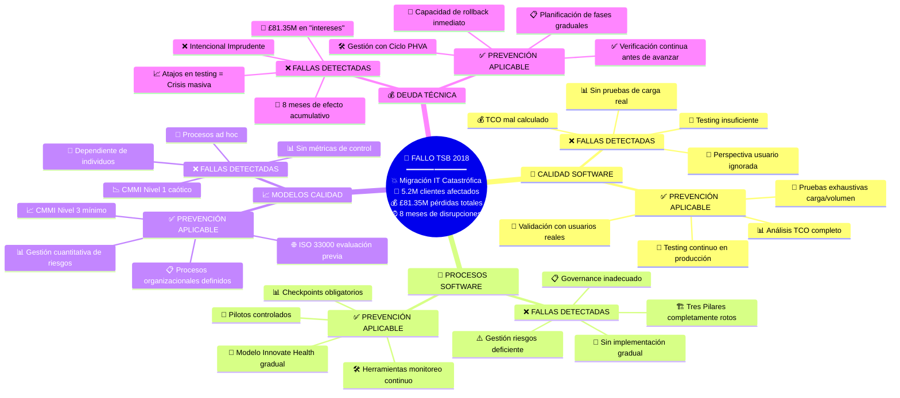

# 🏦 Análisis de Caso sobre Fallos de Software: TSB Bank 2018

## 📋 Información General

**Caso asignado**: TSB Bank - Fallo de Migración IT (Abril 2018)  
**Modalidad**: Parejas  
**Producto elegido**: 🗺️ **Mapa Conceptual**  
**Tiempo exposición**: 5 minutos máximo

---

## 🎯 Competencias Evaluadas

- ✅ **Analiza críticamente** fallos en sistemas reales de software
- ✅ **Aplica conceptos** de calidad, procesos y deuda técnica para diagnosticar errores  
- ✅ **Integra herramientas** digitales y manuales para comunicar ideas técnicas
- ✅ **Colabora en equipos** para proponer soluciones viables y explicarlas efectivamente

---

## 🔍 Análisis Individual: Respuestas a Interrogantes Clave

### **Pregunta 1: Identificación del problema**
#### ❓ **¿Qué falló en el sistema y por qué?**

**🔴 Fallo Técnico Principal:**
- La nueva plataforma IT experimentó **fallas técnicas inmediatas** tras una migración exitosa de datos
- **5.2 millones de clientes** quedaron sin acceso a servicios bancarios (online, móvil, telefónica, sucursales)
- Duración del problema: **8 meses** (abril a diciembre 2018)

**🔍 Causas Raíz identificadas:**
1. **Testing insuficiente** en condiciones reales de carga y volumen
2. **Governance deficiente** del proyecto de migración  
3. **Gestión inadecuada** de riesgos operacionales con terceros
4. **Falta de planificación** para contingencias y rollback
5. **Ausencia de implementación gradual** (big bang deployment)

### **Pregunta 2: Impacto**  
#### ❓ **¿Cómo afectó a usuarios y la reputación de la empresa?**

**👥 Impacto en Usuarios:**
- **5.2 millones de clientes** afectados inicialmente
- Imposibilidad de acceder a cuentas, realizar transacciones o pagos
- Especial impacto en **clientes vulnerables** (personas mayores, dependientes de servicios digitales)
- £32.7M pagados en **compensaciones** por daños sufridos

**📉 Impacto en la Empresa:**
- **Multas regulatorias**: £48.65M (£29.75M FCA + £18.9M PRA)
- **Costo total**: £81.35M (multas + compensaciones)
- **Pérdida masiva de confianza** y reputación de marca
- **Intervención regulatoria** directa y supervisión aumentada
- Daño irreversible a la credibilidad como institución financiera confiable

---

## 🧠 Análisis en Pareja: Aplicación de Conceptos de la Semana

### **Pregunta 3: Elementos de calidad/procesos ausentes**
#### ❓ **¿Qué elementos del proceso de software o de la calidad estuvieron ausentes o fueron deficientes?**

#### **🏗️ Los Tres Pilares Rotos:**

| Pilar | ❌ **Lo que falló** | ✅ **Lo que debió aplicarse** |
|-------|-------------------|------------------------------|
| **🔄 PROCESOS** | Governance inadecuado, falta de control de proyecto, ausencia de checkpoints | Procesos estructurados con gates obligatorios, governance robusto tipo CMMI |
| **⚙️ MÉTODOS** | Testing insuficiente, gestión de riesgos deficiente, falta de metodologías probadas | Testing exhaustivo, gestión de riesgos sistemática, metodologías ágiles graduales |
| **🛠️ HERRAMIENTAS** | Problemas con tercerización, falta de monitoreo en tiempo real, ausencia de rollback automático | Herramientas de monitoreo continuo, sistemas de rollback automático, gestión de terceros robusta |

#### **🎯 Calidad del Software Ausente:**
- **Perspectiva Usuario ignorada**: No se consideró el impacto real en 5.2M clientes
- **TCO mal calculado**: Solo vieron costos de migración, ignoraron riesgo de falla  
- **Testing inadecuado**: Falta de pruebas de estrés, carga y volumen real
- **Resiliencia operacional nula**: Sin capacidad de recuperación rápida

### **Pregunta 4: Deuda técnica contribuyente**
#### ❓ **¿Qué tipo de deuda técnica puede haber contribuido al fallo?**

#### **💰 Análisis de Deuda Técnica (Matriz Ward Cunningham):**

| **Tipo de Deuda** | **Clasificación** | **Evidencia en TSB** |
|-------------------|-------------------|---------------------|
| **❌ Intencional Imprudente** | **PRINCIPAL CULPABLE** | *"No tenemos tiempo para pruebas exhaustivas"* - Prisa por migrar sin testing adecuado |
| **😵 No Intencional Imprudente** | **Secundaria** | Posible falta de conocimiento sobre gestión de riesgos en migraciones masivas |

#### **📊 Impacto de la Deuda Técnica:**
- **Costo de "intereses"**: £81.35M por tomar el atajo de no hacer testing
- **Tiempo de resolución**: 8 meses (efecto acumulativo masivo)
- **20-40% del presupuesto**: Confirma la estadística de que la deuda técnica "come" recursos
- **Calidad externa afectada**: La deuda interna se convirtió en defectos masivos para usuarios

### **Pregunta 5: Modelo de calidad preventivo**
#### ❓ **¿Qué modelo o práctica de calidad habría ayudado a evitarlo?**

#### **📈 Diagnóstico de Madurez:**
**TSB operaba en CMMI Nivel 1 (Inicial)**:
- ✅ Procesos impredecibles e improvisados
- ✅ Dependientes de individuos específicos  
- ✅ Resultados inconsistentes
- ✅ Falta de disciplina organizacional

#### **🏆 Solución: CMMI Nivel 3 Mínimo**

| **Nivel CMMI** | **Prácticas que habrían prevenido el fallo** |
|----------------|---------------------------------------------|
| **📊 Nivel 2: Gestionado** | • Gestión disciplinada de proyectos<br/>• Control de configuración<br/>• Aseguramiento de calidad básico |
| **📋 Nivel 3: Definido** | • **Procesos organizacionales definidos**<br/>• **Gestión integrada de proyectos**<br/>• **Gestión de riesgos sistemática**<br/>• **Validación y verificación** |

#### **🌐 Estándares Adicionales Aplicables:**
- **ISO/IEC 33000 (SPICE)**: Evaluación de capacidad de procesos ANTES de migración
- **ISO/IEC/IEEE 12207**: Marco de ciclo de vida con actividades de V&V obligatorias
- **🏥 Modelo Innovate Health**: Implementación gradual con pilotos y retroalimentación

---

## 🗺️ Producto Final: Mapa Conceptual

### **Estructura del Mapa Conceptual**



### **🔗 Interconexiones Clave Identificadas**

#### **Flujo del Fallo:**
```
🎯 Calidad Ignorada 
    ↓ 
🔄 Procesos Caóticos 
    ↓ 
📈 Madurez Nivel 1 
    ↓ 
💰 Deuda Técnica Masiva 
    ↓ 
🏦 Catástrofe TSB
```

#### **Principio Unificador:**
> **"TSB demostró que ignorar los 4 pilares del aseguramiento de calidad convierte un proyecto de migración en una catástrofe de £81.35M. La calidad no es un lujo, es una necesidad crítica."**

---

## 🤖 Uso de IA y Prompts

### **Herramientas Utilizadas:**
- **Claude (Anthropic)**: Análisis técnico del caso y aplicación de conceptos de calidad
- **Mermaid**: Generación del mapa conceptual visual

### **Propósito del Uso:**
1. **Análisis del problema**: Estructurar la aplicación de conceptos CMMI, deuda técnica y procesos al caso TSB
2. **Diseño del producto**: Crear estructura del mapa conceptual centrado en los 4 pilares de SQA
3. **Organización de ideas**: Conectar sistemáticamente las fallas con los conceptos teóricos estudiados

### **Prompts Utilizados:**

**Prompt 1:**
> "Analiza el caso TSB Bank 2018 aplicando específicamente los conceptos de CMMI, deuda técnica de Ward Cunningham, los tres pilares de procesos de software (proceso-métodos-herramientas), y la economía TCO. Identifica qué nivel de madurez CMMI tenía TSB y qué tipo específico de deuda técnica causó el fallo."

**Prompt 2:**  
> "Diseña la estructura de un mapa conceptual que muestre las interconexiones entre calidad de software, procesos de software, modelos de calidad y deuda técnica aplicadas al fallo de TSB 2018. El mapa debe mostrar tanto lo que falló como las soluciones preventivas, organizando la información para una exposición de 5 minutos."

### **Intervención Humana:**
- **Edición crítica**: Adaptamos el análisis genérico de IA al contexto específico del caso TSB con cifras exactas y evidencias concretas
- **Estructura personalizada**: Reorganizamos la información siguiendo la rúbrica de evaluación para maximizar la calificación  
- **Conexiones propias**: Desarrollamos las interconexiones entre conceptos basadas en nuestra comprensión de las lecturas de la semana
- **Síntesis creativa**: Creamos el "principio unificador" y las metáforas que conectan el caso con los 4 pilares de SQA

---

## 🎤 Guión para Exposición Oral (5 minutos)

### **⏱️ Estructura Temporal:**

**🕐 Minuto 1: Contexto del Caso**
- "TSB Bank, abril 2018: 5.2M clientes sin servicios bancarios por 8 meses"  
- "£81.35M en pérdidas totales por una migración IT fallida"

**🕑 Minutos 2-4: Análisis de los 4 Pilares**
- **Calidad**: TCO ignorado, testing insuficiente
- **Procesos**: Tres pilares rotos, falta governance  
- **Modelos**: CMMI Nivel 1 caótico vs Nivel 3 necesario
- **Deuda Técnica**: Intencional imprudente = £81.35M intereses

**🕔 Minuto 5: Soluciones y Reflexión**
- "Implementación gradual estilo Innovate Health habría prevenido todo"
- "La calidad no es un costo, es una inversión crítica"

### **👥 Distribución de Participación:**
- **Estudiante A**: Contexto + Calidad + Procesos  
- **Estudiante B**: Modelos + Deuda Técnica + Soluciones

---

## ✅ Checklist de Entrega

- [x] **Análisis del problema (20%)**: Conceptos técnicos específicos aplicados
- [x] **Evaluación del impacto (15%)**: Cifras concretas y análisis crítico personal  
- [x] **Integración conceptos (20%)**: 4 pilares conectados explícitamente con el caso
- [x] **Producto visual (15%)**: Mapa conceptual estructurado y profesional
- [x] **Uso reflexivo de IA (10%)**: Documentación completa con prompts específicos
- [x] **Preparación exposición (20%)**: Guión organizado para 5 minutos exactos

---

## 📚 Lectura Original del Caso

### **TSB fined £48.65m for operational resilience failings**
*Press Releases First published: 20/12/2022 Last updated: 20/12/2022*

The Financial Conduct Authority (FCA) and the Prudential Regulation Authority (PRA) have fined TSB Bank plc ("TSB") a total of £48,650,000 for operational risk management and governance failures, including management of outsourcing risks, relating to the bank's IT upgrade programme. Technical failures in TSB's IT system ultimately resulted in customers being unable to access banking services.

In April 2018, TSB updated its IT systems and migrated the data for its corporate and customer services on to a new IT platform (the "Migration Programme"). While the data itself migrated successfully, the platform immediately experienced technical failures. This resulted in significant disruption to the continuity of TSB's banking services, including branch, telephone, online and mobile banking.

All of TSB's branches and a significant proportion of its 5.2 million customers were affected by the initial issues. Some customers continued to be affected by some issues and it took until December 2018 for TSB to return to business-as-usual. TSB has paid £32.7m in redress to customers who suffered detriment.

TSB's IT migration programme was an ambitious and complex IT change management programme carrying a high level of operational risk. Its success was critical to TSB's ability to provide continuity of critical functions and safety and soundness. However, the regulators' found that TSB failed to organise and control the IT migration programme adequately, and it failed to manage the operational risks arising from its IT outsourcing arrangements with its critical third-party supplier.

Operational resilience is a priority for both the FCA and PRA. As demonstrated by this incident, operational disruption can cause wide-ranging harm and it is critically important firms invest in their resilience.

Mark Steward, FCA Executive Director of Enforcement and Market Oversight said:

*"The failings in this case were widespread and serious which had a real impact on the day-to-day lives of a significant proportion of TSB's customers, including those who were vulnerable.*

*The firm failed to plan for the IT migration properly, the governance of the project was insufficiently robust and the firm failed to take reasonable care to organise and control its affairs responsibly and effectively, with adequate risk management systems."*

Sam Woods, Deputy Governor for Prudential Regulation and Chief Executive Officer of the PRA, said:

*"The PRA expects firms to manage their operational resilience as well as their financial resilience. The disruption to continuity of service experienced by TSB during its IT migration fell below the standard we expect banks to meet."*

TSB was fined £29,750,000 by the FCA and £18,900,000 by the PRA. TSB agreed to resolve this matter with the FCA and PRA qualifying it for a 30% discount in the overall penalty imposed by both regulators. Without this discount, the FCA and PRA would have imposed a combined financial penalty of £69,500,000 (£42,500,0000 by the FCA and £27,000,000 by the PRA).

### **Notes to editors**
- FCA Final Notice to TSB Bank PLC
- PRA Final Notice to TSB Bank PLC  
- TSB Bank PLC ("TSB") is regulated by the Prudential Regulation Authority (PRA) for prudential purposes and by the Financial Conduct Authority (FCA) for conduct matters.

**Background:** TSB is a UK retail bank that provides various services to its customers including personal current accounts; business banking; savings accounts; mortgages; insurance; loans; and credit cards. TSB's customers accessed services through digital channels (both through internet-banking and through its mobile app), telephone banking and by visiting branches.