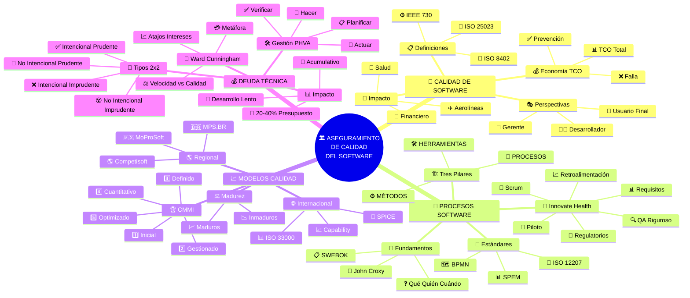
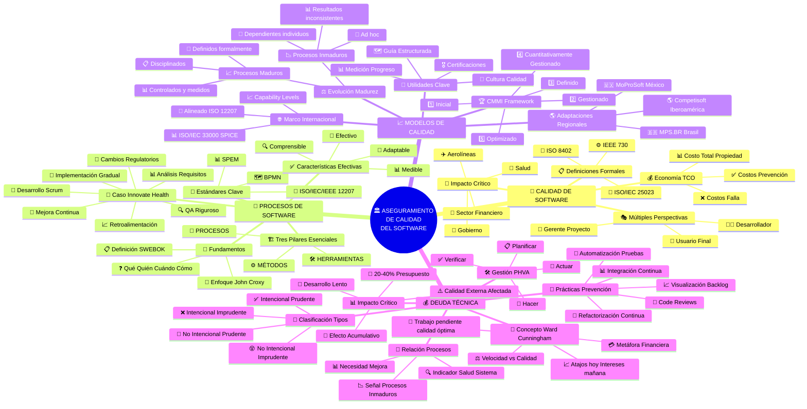
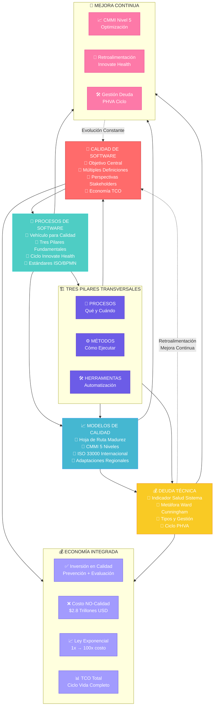

Elabora un mapa conceptual o infografía para conectar los 4 temas principales de la Unidad 1: Calidad de Software, Procesos de Software, Modelos de Calidad y Deuda Técnica.

Asegúrate de relacionar los conceptos clave que se te proporcionaron en el listado. Tu trabajo debe reflejar una comprensión clara de sus interconexiones y dependencias.

## 🎯 Mapa Conceptual: Ecosistema Integrado del Aseguramiento de Calidad

Versión dos:

Versión uno:

## 🌊 Flujo de Interconexiones y Dependencias

## 📋 Síntesis de Conceptos Clave e Interconexiones Fundamentales

### 🎯 **1. CALIDAD DE SOFTWARE - El Objetivo Central**

#### 📋 **Definiciones Formales Complementarias**
- **ISO 8402**: Aptitud para satisfacer necesidades explícitas e implícitas
- **IEEE 730**: Grado de cumplimiento con requisitos establecidos 
- **ISO/IEC 25023:2016**: Proporciona valor a diferentes stakeholders

#### 🎭 **Perspectivas Múltiples pero Unificadas**
- **📱 Usuario Final**: Facilidad de uso y confiabilidad
- **💼 Gerente de Proyecto**: Cumplimiento presupuesto y plazos
- **👨‍💻 Desarrollador**: Calidad interna y mantenibilidad

#### 💰 **Economía TCO (Costo Total de Propiedad)**
- **✅ Costos de Prevención**: Inversión en hacer las cosas bien
- **❌ Costos de Falla**: Gasto por no tener calidad ($2.8 trillones USD en 2018)
- **📊 TCO Completo**: Todos los costos del ciclo de vida del software

### 🔄 **2. PROCESOS DE SOFTWARE - El Vehículo**

#### 🏗️ **Tres Pilares Fundamentales (Transversales)**
- **🔄 PROCESOS**: Definen el QUÉ y CUÁNDO
- **⚙️ MÉTODOS**: Especifican el CÓMO ejecutar
- **🛠️ HERRAMIENTAS**: Proporcionan automatización y soporte

#### 🏥 **Caso Real: Innovate Health (Ciclo Completo)**
1. **🚀 Inicio**: Cambios regulatorios externos
2. **📊 Análisis**: Recolección y validación de requisitos
3. **🔄 Desarrollo**: Scrum con sprints y reuniones diarias
4. **🔍 QA**: Pruebas rigurosas en ambiente real
5. **🎯 Implementación**: Gradual con hospitales piloto
6. **📈 Retroalimentación**: Monitoreo y comentarios usuarios
7. **🔄 Mejora Continua**: Nueva iteración del ciclo

### 📈 **3. MODELOS DE CALIDAD - La Hoja de Ruta**

#### ⚖️ **Evolución: Inmaduros → Maduros**
- **📉 Inmaduros**: Ad hoc, dependientes de individuos, inconsistentes
- **📈 Maduros**: Disciplinados, definidos, controlados y medidos

#### 🏆 **CMMI: Escalera de 5 Niveles**
1. **Inicial** - Impredecible e improvisado
2. **Gestionado** - Proyectos disciplinados  
3. **Definido** - Procesos organizacionales
4. **Cuantitativamente Gestionado** - Métricas y control
5. **Optimizado** - Mejora continua

#### 🌎 **Adaptaciones Regionales**
- **🇧🇷 MPS.BR**: Brasil - Para PyMEs
- **🇲🇽 MoProSoft**: México - Simplificado
- **🌎 Competisoft**: 15 países iberoamericanos

### 💰 **4. DEUDA TÉCNICA - El Indicador**

#### 🏦 **Concepto de Ward Cunningham**
- **💳 Metáfora Financiera**: Atajos hoy = Intereses mañana
- **⚖️ Trade-off**: Velocidad de entrega vs Calidad interna
- **📈 Trabajo Pendiente**: Para alcanzar calidad óptima

#### 🎯 **Matriz de Clasificación (2x2)**
- **✅ Intencional Prudente**: "Lo arreglaremos después del deadline"
- **❌ Intencional Imprudente**: "No tenemos tiempo para diseño"
- **🤔 No Intencional Prudente**: "Ahora sabemos cómo debería haberse hecho"
- **😵 No Intencional Imprudente**: "¿Qué es el diseño?"

#### 🛠️ **Gestión con Ciclo PHVA**
- **📋 Planificar**: Tiempo para pagar deuda
- **🔧 Hacer**: Implementar mejoras (refactoring, code reviews)
- **✅ Verificar**: Medir efecto en calidad
- **🔄 Actuar**: Ajustar y continuar mejorando

## 🔗 **Interconexiones Fundamentales del Ecosistema**

### 🌊 **Flujo Principal Cíclico**
**Calidad** (objetivo) → **Procesos** (vehículo) → **Modelos** (hoja de ruta) → **Deuda Técnica** (indicador) → **Retroalimentación a Calidad**

### 🏗️ **Elementos Transversales**
- **Tres Pilares**: Presentes en todos los componentes
- **Mejora Continua**: CMMI nivel 5, ciclo Innovate Health, gestión deuda PHVA
- **Economía Integrada**: TCO, ley exponencial, costos prevención vs falla

### 💡 **Principio Unificador**
> **"Los cuatro elementos forman un ecosistema vivo donde la calidad es la razón de ser, los procesos son el motor, los modelos proporcionan la dirección y la deuda técnica actúa como el tablero de instrumentos que nos indica la salud del sistema."**

La mejora continua no es un extra, sino el **ADN del sistema completo**, asegurando que cada ciclo sea mejor que el anterior y que la organización evolucione hacia la excelencia sostenible.
