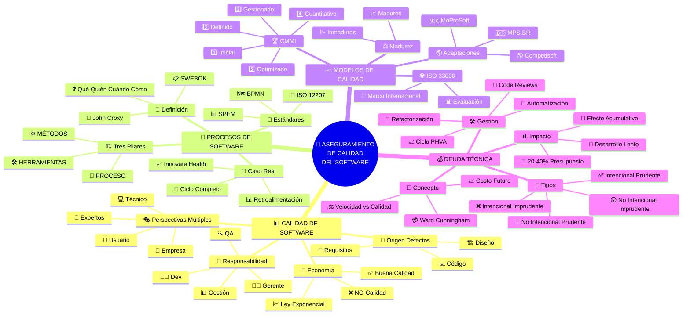
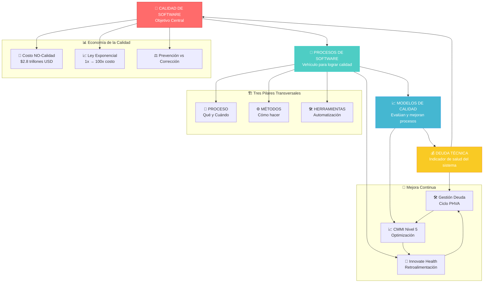

Elabora un mapa conceptual o infografía para conectar los 4 temas principales de la Unidad 1: Calidad de Software, Procesos de Software, Modelos de Calidad y Deuda Técnica.

Asegúrate de relacionar los conceptos clave que se te proporcionaron en el listado. Tu trabajo debe reflejar una comprensión clara de sus interconexiones y dependencias.

## 🗺️ Mapa Conceptual Principal: Los 4 Pilares del Aseguramiento de Calidad

## 🔗 Diagrama de Interconexiones y Dependencias

## 📋 Resumen de Conceptos Clave e Interconexiones

### 🎯 **Calidad de Software como Objetivo Central**
- **Definiciones múltiples**: ISO 8402, IEEE, Capers Jones
- **Perspectivas stakeholders**: Usuario, Empresa, Técnico, Expertos
- **Economía**: Costo de buena calidad vs NO-calidad ($2.8 trillones USD en 2018)
- **Origen defectos**: 94% código, 5% diseño, 1% requisitos (pero más costosos)

### 🔄 **Procesos de Software como Vehículo**
- **Estructura organizacional**: Qué, Quién, Cuándo, Cómo
- **Tres pilares**: Proceso + Métodos + Herramientas
- **Caso real**: Innovate Health (ciclo completo con retroalimentación)
- **Estándares**: ISO/IEC/IEEE 12207, BPMN, SPEM

### 📈 **Modelos de Calidad como Hoja de Ruta**
- **Evolución**: Inmaduros (ad hoc) → Maduros (disciplinados)
- **CMMI**: 5 niveles desde Inicial hasta Optimizado
- **Marco internacional**: ISO/IEC 33000 (SPICE)
- **Adaptaciones regionales**: MPS.BR, MoProSoft, Competisoft

### 💰 **Deuda Técnica como Indicador**
- **Metáfora financiera**: Atajos hoy = Intereses mañana
- **Tipos**: Intencional/No intencional × Prudente/Imprudente
- **Impacto**: 20-40% presupuesto tecnológico, efecto acumulativo
- **Gestión**: Refactorización, code reviews, automatización, ciclo PHVA

### 🔗 **Interconexiones Fundamentales**

1. **Flujo principal**: Calidad → Procesos → Modelos → Deuda Técnica → Calidad
2. **Tres pilares transversales**: Presente en todos los elementos
3. **Mejora continua**: CMMI nivel 5, ciclo Innovate Health, gestión deuda técnica
4. **Economía integrada**: Ley exponencial, prevención vs corrección, ROI sistemático

> **Conclusión**: Los cuatro elementos forman un **ecosistema integrado** donde la calidad es el objetivo central, los procesos son el vehículo, los modelos proporcionan la hoja de ruta y la deuda técnica actúa como indicador de salud del sistema. La mejora continua y los tres pilares (proceso, métodos, herramientas) son transversales a todo el sistema.
