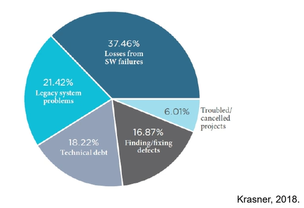
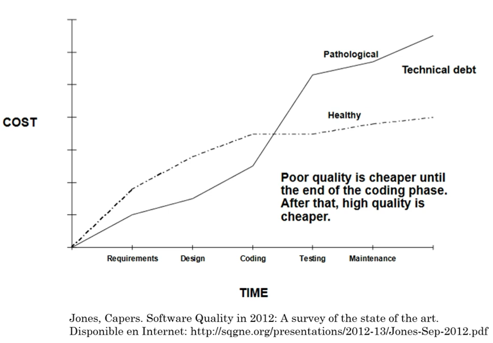

# 🔬 **Calidad de Software: Un Análisis Detallado**

Continuando nuestro viaje en la calidad del software, en este video profundizaremos en los conceptos clave, respaldándolos con datos y definiciones formales. Vamos a desmitificar de dónde vienen los errores, cuánto nos cuestan realmente y cómo podemos construir una cultura de calidad.

## 🐛 **El Origen de los Defectos: ¿Dónde Nacen los Bugs?**

Contrario a la creencia popular de que los errores solo surgen al codificar, la realidad es mucho más compleja. Un estudio de Capers Jones, que sigue siendo relevante, nos muestra dónde se "inyectan" los defectos a lo largo del ciclo de vida del desarrollo.

Gráfico de Densidad de Defectos:

| Fase         | Defectos |
| :----------- | :------- |
| Codificación | 94%      |
| Diseño       | 3%       |
| Arquitectura | 2%       |
| Requisitos   | 1%       |
| Pruebas      | 10%      |

-   Aunque la fase de **codificación** es la que genera la mayor *cantidad* de defectos, estos suelen ser los más fáciles de corregir[1].
-   Los defectos introducidos en fases tempranas como **Requisitos, Arquitectura y Diseño** son más peligrosos. Son más graves, más severos y a menudo transversales a todo el sistema, lo que los hace mucho más costosos de arreglar[2][3].

### **Fuentes Comunes de Defectos**
Los errores no aparecen por arte de magia. Generalmente, su causa raíz se encuentra en:
-   **Requisitos incompletos o erróneos**: El clásico "teléfono descompuesto".
-   **Fallos en la arquitectura o diseño detallado**: Decisiones fundamentales incorrectas que afectan todo el proyecto.
-   **Código fuente**: Aunque son numerosos, suelen ser más superficiales.
-   **Fallos de seguridad**: A menudo pasados por alto porque muchos desarrolladores no están entrenados para programar con una mentalidad de seguridad.
-   **Documentación obsoleta o incorrecta**.
-   **Casos de prueba mal diseñados** o datos de prueba inadecuados.

> La clave no es solo corregir el bug, sino **detectar su causa raíz** para evitar que vuelva a ocurrir[4].

## 🏆 **Definiendo la Calidad: Más Allá de la Percepción**

Intuitivamente, la calidad es fácil de reconocer: es esa sensación de que algo es bueno, funciona bien y tiene características que lo hacen diferente. Sin embargo, para construirla, necesitamos definiciones más formales y medibles[5].

| Fuente             | Definición de Calidad                                                                                                                |
| :----------------- | :----------------------------------------------------------------------------------------------------------------------------------- |
| **ISO 8402**       | El conjunto de propiedades de un producto que le confieren la aptitud para satisfacer **necesidades explícitas e implícitas**[6][7]. |
| **IEEE**           | El grado en el cual un software **cumple con los requisitos especificados**.                                                         |
| **Capers Jones**   | La combinación de **bajas tasas de defectos y altos niveles de satisfacción del cliente**.                                           |
| **ISO (Refinada)** | El grado en que un producto satisface las necesidades de sus *stakeholders*, proporcionando **valor tangible**[6][8].                |

La idea central es que la calidad se trata de comparar lo que se esperaba del software (los requisitos) con lo que finalmente se entrega, asegurando que se aporte valor real a los interesados.

## 💸 **El Iceberg de Costos: ¿Cuánto Cuesta la NO Calidad?**

La pregunta no es cuánto cuesta la calidad, sino **cuánto nos cuesta no tenerla**. Los estudios son contundentes:
> En 2018, el costo de la mala calidad del software en EE. UU. se estimó en **\$2.8 trillones de dólares**[9]. En 2020, la cifra fue de **\$2.08 trillones**, siendo las fallas de software en operación el principal contribuyente[10].

Este costo se entiende mejor con el **modelo del iceberg**, que muestra que la mayoría de los costos están ocultos bajo la superficie[7].

-   **Costos Visibles (Punta del Iceberg)**
    -   Reportes de problemas de clientes.
    -   Llamadas a soporte técnico.
    -   Demandas y garantías.
-   **Costos Ocultos (Bajo el Agua)**
    -   Reprocesos y desperdicio.
    -   Horas extras no contabilizadas (modo crisis).
    -   Pérdida de reputación y oportunidades de mercado.
    -   Deuda técnica acumulada[7].
    -   Baja moral y alta rotación del personal.

### **Invertir en Calidad vs. Pagar por Errores**
La calidad no es un gasto, **es una inversión estratégica**[11]. Podemos dividir los costos en dos grandes categorías:

-   **✅ Costo de la Buena Calidad (Inversión)**
    -   **Costos de Prevención**: Actividades para minimizar defectos (revisiones de diseño, capacitación, estándares de código)[12][11].
    -   **Costos de Evaluación (Appraisal)**: Actividades para medir la calidad (planificación de pruebas, ejecución de tests, inspecciones)[11].

-   **❌ Costo de la Mala Calidad (Gasto)**
    -   **Costos de Fallos Internos**: Errores encontrados *antes* de la entrega (costo de corregir y volver a probar)[11].
    -   **Costos de Fallos Externos**: Errores encontrados por el cliente *después* de la entrega (soporte, parches de emergencia, pérdida de clientes, daños a la marca)[11].

## 📈 **La Ley Exponencial: El Costo de Corregir Tarde**

La regla de oro en la ingeniería de software es simple y brutal: **entre más tarde se detecta un error, más costoso es corregirlo**.

Un error que podría costar **\$1** arreglar en la fase de requisitos, puede costar **\$100 o más** si llega a producción[13]. Por eso, las prácticas que retrasan la detección de errores son atajos directos a mayores problemas.

### **Prácticas a Evitar vs. Prácticas Recomendadas**

| Atajos a la Mediocridad 📉                                              | El Camino a la Excelencia 📈                                                                                              |
| :--------------------------------------------------------------------- | :----------------------------------------------------------------------------------------------------------------------- |
| Confiar únicamente en las pruebas al final del ciclo.                  | Realizar **revisiones e inspecciones tempranas** en todas las fases (requisitos, diseño, código)[14][15].                |
| Pruebas informales hechas solo por desarrolladores (ser juez y parte). | Implementar un proceso de **Aseguramiento de Calidad (QA)** que cubra todo el ciclo de vida[14].                         |
| Una planeación deficiente de la calidad.                               | **Analizar la causa raíz** de los defectos para prevenir su recurrencia[4].                                              |
| No tener un registro de los defectos.                                  | Usar **herramientas de seguimiento de defectos** (como Jira, Bugzilla) para registrar, analizar y gestionar errores[16]. |

## 🤝 **Lograr la Calidad: Un Compromiso de Equipo**

La calidad no surge por accidente ni es responsabilidad exclusiva de un departamento de QA[17]. Es el resultado directo de un **compromiso consciente de todo el equipo**. Se basa en cuatro pilares:

1.  **Gestión de Proyectos Sólida**: Incluso en equipos autogestionados, la gestión es crucial.
2.  **Procesos y Métodos Robustos**: Adoptar prácticas de ingeniería de software probadas.
3.  **Control de Calidad Efectivo**: Implementar revisiones, pruebas y mediciones.
4.  **Aseguramiento de la Calidad Proactivo**: Fomentar la mejora continua.

### **Tu Responsabilidad como Ingeniero**
Cada miembro del equipo tiene un rol que jugar. Como desarrollador, tu compromiso con la calidad implica:
1.  **Eliminar tus propios defectos**: Probar tu código y asegurarte de que sea limpio y profesional[17].
2.  **Ir más allá de la corrección**: No te limites a arreglar el síntoma; investiga y entiende la **causa raíz** del error.
3.  **Aprender a prevenir**: Utiliza ese conocimiento para no cometer el mismo error dos veces, cerrando así el ciclo de mejora continua.

---

https://www.youtube.com/watch?v=7c4nn26BXoA

[1] https://pplx-res.cloudinary.com/image/private/user_uploads/2989799/66b61029-8434-48ed-9f75-37379412b5bd/image.jpg
[2] https://www.fing.edu.uy/sites/default/files/biblio/22573/designdefectspsp.pdf
[3] https://www.scopemaster.com/blog/root-causes-of-software-bugs/
[4] https://www.linkedin.com/pulse/art-software-defect-discovery-suresh-yerolkar-1lwrc
[5] https://www.youtube.com/watch?v=Sr3sTFciXro
[6] https://nv.nltu.edu.ua/index.php/journal/article/view/2142/2192
[7] https://www.it-cisq.org/wp-content/uploads/sites/6/2023/09/The-Cost-of-Poor-Quality-Software-in-the-US-2018-Report.pdf
[8] https://informatecdigital.com/en/iso-standards-for-software-development-quality-improvement/&rut=87ead80925b5b9957b011395101eccd77ea9c6f0d39d37a85efda9cc6f493252/
[9] https://www.it-cisq.org/the-cost-of-poor-quality-software-in-the-us-a-2018-report/
[10] https://www.apmdigest.com/cost-of-poor-software-quality-in-us-exceeds-2-trillion
[11] https://tuskr.app/learn/cost-of-quality
[12] https://testsigma.com/blog/defect-prevention/
[13] https://www.browserstack.com/guide/how-to-improve-software-quality
[14] https://www.deviqa.com/blog/20-software-quality-assurance-best-practices/
[15] https://www.youtube.com/watch?v=qgckV4bEbX0
[16] https://blog.qasource.com/top-defect-tracking-tools-and-their-benefits/
[17] https://emvigotech.com/blog/boosting-team-quality-software-development-strategies/
[18] https://graphite.dev/guides/measuring-and-calculating-defect-density
[19] https://graphite.dev/guides/understanding-defect-density-in-software-development
[20] https://www.scnsoft.com/software-testing/services/quality-assessment
[21] https://daily.dev/blog/defect-density-and-escape-rate-agile-metrics-guide-2024
[22] https://watech.wa.gov/sites/default/files/2024-10/EA-01-02-G%20Software%20Quality%20Best%20Practices.pdf
[23] https://www.sciencedirect.com/topics/computer-science/quality-standard
[24] https://news.blackduck.com/2021-01-06-Synopsys-Sponsored-CISQ-Research-Estimates-Cost-of-Poor-Software-Quality-in-the-US-2-08-Trillion-in-2020
[25] https://katalon.com/resources-center/blog/software-quality-management-best-practices
[26] https://www.monitask.com/en/business-glossary/defect-density
[27] https://flylib.com/books/en/1.428.1/cost_effectiveness_of_phase_defect_removal.html
[28] https://www.youtube.com/watch?v=1zhMkMO5iW4
[29] https://www.qodo.ai/blog/understanding-the-distinction-between-code-bugs-and-defects-in-software-testing/
[30] https://scispace.com/pdf/the-dimensions-of-software-quality-fywwk3q853.pdf
[31] https://www.tutorialspoint.com/software_quality_management/software_quality_management_metrics.htm
[32] https://www.ijser.org/paper/Valuing-Software-Quality-Analysis.html
[33] https://www.6sigma.us/six-sigma-in-focus/software-quality/
[34] https://en.wikipedia.org/wiki/ISO_9126
[35] https://onlinelibrary.wiley.com/doi/10.1002/9781119134527.ch9
[36] https://www.linkedin.com/pulse/how-software-quality-impacts-business-profitability-logika-mostar-81dre
[37] https://www.darbtech.net/en/blog/business-management-1/what-is-the-cost-of-non-quality-in-software-development-9
[38] https://www.infosecurity-magazine.com/news/poor-software-quality-costs-us/
[39] https://testrigor.com/blog/what-is-the-cost-of-quality-in-software-testing/
[40] https://www.lambdatest.com/blog/software-defect-prediction/