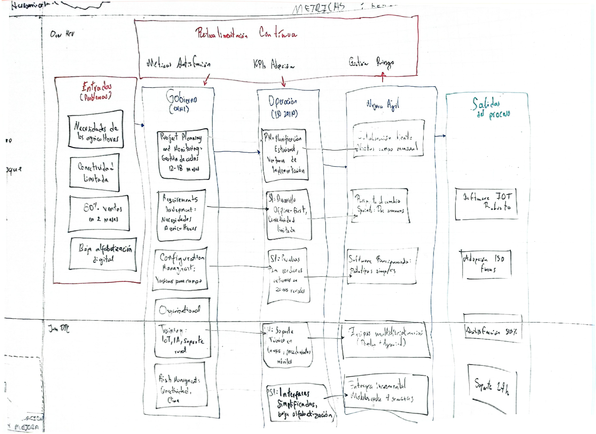

# DIAGRAMA CANVAS - MODELO HÍBRIDO INTEGRADO AGTECH

## Visión General del Proceso en 3 Capas

El modelo híbrido para AgTech "CampoInteligente" integra tres marcos de calidad en un proceso cohesivo de 3 capas que responde específicamente a los desafíos del sector agrícola tecnológico.

---

## 🏛️ CAPA 1: GOBIERNO (CMMI)
### Función: Establecer la dirección estratégica y marco de control

**Contribución:** Proporciona la estructura organizacional y los procesos de alto nivel necesarios para gestionar proyectos complejos en un entorno con ciclos largos y alta incertidumbre.

#### Procesos Clave:
- **📋 Project Planning & Monitoring:** Gestiona los ciclos de venta de 12-18 meses y la estacionalidad extrema
- **📝 Requirements Development:** Captura y valida necesidades específicas de agricultores con baja alfabetización digital
- **⚙️ Configuration Management:** Asegura trazabilidad de versiones de software para condiciones extremas de campo
- **🎓 Organizational Training:** Desarrolla capacidades en IoT, AI y soporte técnico rural
- **⚠️ Risk Management:** Gestiona riesgos de conectividad, factores climáticos y externos

#### Valor Agregado:
- Estructura para manejar la complejidad del sector agrícola
- Procesos repetibles para proyectos con alta variabilidad
- Marco de control para mitigar riesgos específicos del agro

---

## 🔧 CAPA 2: OPERACIÓN (ISO 29110)
### Función: Ejecutar las actividades técnicas y operacionales

**Contribución:** Traduce las directrices estratégicas en actividades operacionales específicas, adaptadas al tamaño de VSE (18 empleados) y las limitaciones técnicas del entorno rural.

#### Procesos Clave:
- **📅 PM: Planificación Estacional:** Crea ventanas de implementación considerando picos de demanda
- **💻 SI: Desarrollo Offline-First:** Desarrolla software que funciona con conectividad limitada
- **🧪 SI: Pruebas Condiciones Extremas:** Valida software en ambientes rurales reales
- **🛠️ PM: Soporte Técnico Campo:** Establece procedimientos para soporte móvil presencial
- **📱 SI: Interfaces Simplificadas:** Diseña UX/UI para usuarios con baja alfabetización digital

#### Valor Agregado:
- Procesos operacionales escalables para VSE
- Metodología específica para desarrollo agrícola
- Productos de trabajo adaptados al contexto rural

---

## 🔄 CAPA 3: MEJORA (ÁGIL)
### Función: Optimizar continuamente y adaptar rápidamente

**Contribución:** Proporciona mecanismos de mejora continua y adaptación rápida a las condiciones cambiantes del sector agrícola, manteniendo la proximidad con el cliente final.

#### Procesos Clave:
- **👥 Colaboración Cliente:** Visitas mensuales en campo durante temporada alta
- **🔀 Respuesta al Cambio:** Sprints de 2 semanas para adaptación rápida
- **⚡ Software Funcionando:** Prototipos simples y funcionales cada iteración
- **🤝 Equipos Multidisciplinarios:** Integra desarrolladores con expertos agrónomos
- **📦 Entrega Incremental:** Módulos funcionales cada 4 semanas

#### Valor Agregado:
- Adaptación rápida a condiciones cambiantes del agro
- Feedback directo de usuarios finales en campo
- Mejora continua basada en métricas reales

---

## 🔄 FLUJO DE INTEGRACIÓN

### Entradas del Sistema:
- **🌾 Necesidades Agricultores:** Requerimientos específicos del sector
- **🔗 Limitaciones Conectividad:** Restricciones técnicas rurales
- **📊 Estacionalidad:** 80% de ventas concentradas en 2 meses
- **👨‍🌾 Baja Alfabetización Digital:** Perfil de usuario específico

### Procesamiento por Capas:

1. **CAPA 1 → CAPA 2:** Las directrices estratégicas se convierten en planes operacionales
2. **CAPA 2 → CAPA 3:** Los procesos operacionales se ejecutan de forma ágil e iterativa
3. **CAPA 3 → Salidas:** Las mejoras continuas generan productos optimizados

### Salidas del Sistema:
- **📱 Software IoT Robusto:** Producto técnico adaptado
- **🎯 Adopción 750 Fincas:** Meta de crecimiento específica
- **😊 Satisfacción 80%:** Objetivo de experiencia usuario
- **⏱️ Soporte 24h:** Estándar de servicio mejorado

### Retroalimentación Continua:
- **📈 Métricas Satisfacción:** Datos de experiencia usuario
- **🎯 KPIs Adopción:** Indicadores de crecimiento
- **🛡️ Gestión Riesgos:** Información para mitigación proactiva

---

## 🎯 BENEFICIOS DE LA INTEGRACIÓN

### Sinergia entre Modelos:
1. **CMMI** proporciona la estructura y disciplina organizacional
2. **ISO 29110** ofrece procesos operacionales eficientes para VSE
3. **Ágil** aporta flexibilidad y mejora continua

### Adaptación Específica para AgTech:
- **Estacionalidad:** Procesos que reconocen y aprovechan ciclos agrícolas
- **Conectividad Limitada:** Desarrollo offline-first desde el diseño
- **Usuario Rural:** UX/UI simplificado y soporte presencial
- **Escalabilidad:** Arquitectura modular para crecimiento gradual

### Resultados Esperados:
- Reducción de rotación de clientes del 40% al 15%
- Incremento de fincas monitoreadas de 500 a 750
- Mejora de satisfacción del 55% al 80%
- Optimización del soporte técnico de 72h a 24h

---

## 📊 MÉTRICAS DE CONTROL POR CAPA

| Capa | Métrica Principal | Frecuencia | Responsable |
|------|------------------|------------|-------------|
| Gobierno | % Cumplimiento cronograma estacional | Mensual | PMO |
| Operación | % Funcionalidades offline funcionales | Sprint | Tech Lead |
| Mejora | NPS agricultores | Bimestral | Product Owner |

Este modelo híbrido permite a AgTech "CampoInteligente" mantener la disciplina organizacional necesaria para proyectos complejos, mientras conserva la agilidad para adaptarse rápidamente a las condiciones específicas del sector agrícola. 

## 📐🖊️ DIAGRAMA DEL MODELO HÍBRIDO

```mermaid
graph TB
    subgraph "MODELO HÍBRIDO AGTECH - PROCESO INTEGRADO EN 3 CAPAS"
        
        subgraph CAPA1 ["🏛️ CAPA 1: GOBIERNO (CMMI)"]
            direction TB
            G1["📋 Project Planning &<br/>Monitoring<br/><em>Gestión ciclos 12-18 meses</em>"]
            G2["📝 Requirements<br/>Development<br/><em>Necesidades agricultores</em>"]
            G3["⚙️ Configuration<br/>Management<br/><em>Versiones para campo</em>"]
            G4["🎓 Organizational<br/>Training<br/><em>IoT, AI, soporte rural</em>"]
            G5["⚠️ Risk<br/>Management<br/><em>Conectividad, clima</em>"]
        end
        
        subgraph CAPA2 ["🔧 CAPA 2: OPERACIÓN (ISO 29110)"]
            direction TB
            O1["📅 PM: Planificación<br/>Estacional<br/><em>Ventanas implementación</em>"]
            O2["💻 SI: Desarrollo<br/>Offline-First<br/><em>Conectividad limitada</em>"]
            O3["🧪 SI: Pruebas<br/>Condiciones Extremas<br/><em>Ambientes rurales</em>"]
            O4["🛠️ PM: Soporte<br/>Técnico Campo<br/><em>Procedimientos móviles</em>"]
            O5["📱 SI: Interfaces<br/>Simplificadas<br/><em>Baja alfabetización</em>"]
        end
        
        subgraph CAPA3 ["🔄 CAPA 3: MEJORA (ÁGIL)"]
            direction TB
            A1["👥 Colaboración<br/>Cliente<br/><em>Visitas campo mensual</em>"]
            A2["🔀 Respuesta al<br/>Cambio<br/><em>Sprints 2 semanas</em>"]
            A3["⚡ Software<br/>Funcionando<br/><em>Prototipos simples</em>"]
            A4["🤝 Equipos<br/>Multidisciplinarios<br/><em>Dev + Agronomía</em>"]
            A5["📦 Entrega<br/>Incremental<br/><em>Módulos cada 4 sem</em>"]
        end
        
        subgraph INPUTS ["📥 ENTRADAS DEL PROCESO"]
            I1["🌾 Necesidades<br/>Agricultores"]
            I2["🔗 Limitaciones<br/>Conectividad"]
            I3["📊 Estacionalidad<br/>80% en 2 meses"]
            I4["👨‍🌾 Baja Alfabetización<br/>Digital"]
        end
        
        subgraph OUTPUTS ["📤 SALIDAS DEL PROCESO"]
            OUT1["📱 Software IoT<br/>Robusto"]
            OUT2["🎯 Adopción 750<br/>Fincas"]
            OUT3["😊 Satisfacción<br/>80%"]
            OUT4["⏱️ Soporte<br/>24h"]
        end
        
        subgraph FEEDBACK ["🔄 RETROALIMENTACIÓN CONTINUA"]
            F1["📈 Métricas<br/>Satisfacción"]
            F2["🎯 KPIs<br/>Adopción"]
            F3["🛡️ Gestión<br/>Riesgos"]
        end
    end
    
    %% Flujos entre capas
    INPUTS --> CAPA1
    CAPA1 --> CAPA2
    CAPA2 --> CAPA3
    CAPA3 --> OUTPUTS
    
    %% Retroalimentación
    CAPA3 --> FEEDBACK
    FEEDBACK --> CAPA1
    FEEDBACK --> CAPA2
    
    %% Flujos específicos internos
    G1 --> O1
    G2 --> O2
    G3 --> O3
    G4 --> O4
    G5 --> O5
    
    O1 --> A1
    O2 --> A2
    O3 --> A3
    O4 --> A4
    O5 --> A5
    
    %% Estilos
    classDef gobierno fill:#e1f5fe,stroke:#01579b,stroke-width:2px
    classDef operacion fill:#f3e5f5,stroke:#4a148c,stroke-width:2px
    classDef agil fill:#e8f5e8,stroke:#1b5e20,stroke-width:2px
    classDef input fill:#fff3e0,stroke:#e65100,stroke-width:2px
    classDef output fill:#e0f2f1,stroke:#00695c,stroke-width:2px
    classDef feedback fill:#fce4ec,stroke:#880e4f,stroke-width:2px
    
    class G1,G2,G3,G4,G5 gobierno
    class O1,O2,O3,O4,O5 operacion
    class A1,A2,A3,A4,A5 agil
    class I1,I2,I3,I4 input
    class OUT1,OUT2,OUT3,OUT4 output
    class F1,F2,F3 feedback
```

