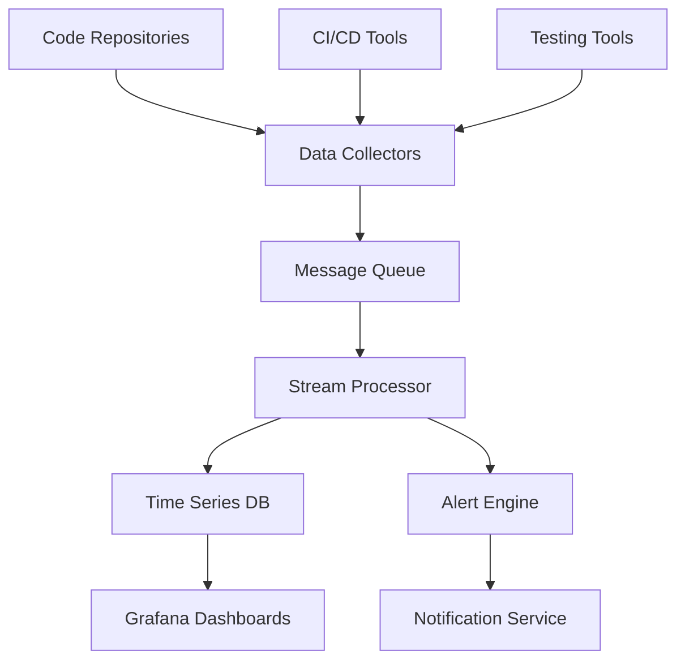

# 📊 Dashboards Interactivos y Análisis en Tiempo Real

## 🎯 Diseño de Interfaces Centradas en el Usuario

### 🏢 Dashboards Ejecutivos

**Visualizaciones de alto nivel** enfocadas en **KPIs estratégicos** para la toma de decisiones gerenciales:

#### 📈 **Métricas Ejecutivas Clave**

| **KPI** | **Descripción** | **Frecuencia** |
|---------|-----------------|----------------|
| 💚 **Health Score General** | Estado integral del producto con trending histórico | ⏱️ Tiempo real |
| ⚖️ **Balance Velocidad-Calidad** | Métricas de equilibrio entre velocidad y calidad | 📅 Diario |
| 💰 **Costo de Calidad** | ROI de actividades de QA | 📊 Semanal |
| 🏆 **Benchmarks Industriales** | Comparativas contra estándares del sector | 📈 Mensual |
| 🔮 **Predicciones de Entrega** | Estimaciones basadas en tendencias de calidad | 🎯 Por sprint |

#### 🎨 **Características de Visualización**
- 🚦 **Semáforos de estado** (Verde/Amarillo/Rojo)
- 📊 **Gráficos de tendencias** históricos
- 🎯 **KPIs consolidados** en cards
- 📈 **Proyecciones futuras** basadas en datos
- 🔄 **Actualización automática** cada 15 minutos

---

### 👨‍💻 Dashboards de Desarrollo

**Interfaces técnicas especializadas** para equipos de desarrollo con información operacional detallada:

#### 🔧 **Métricas Técnicas Detalladas**

| **Categoría** | **Métricas Incluidas** | **Propósito** |
|---------------|------------------------|---------------|
| 🧩 **Calidad por Componente** | Complejidad, cobertura, defectos | 🔍 Drill-down capability |
| 👀 **Code Review** | Tiempo de ciclo, efectividad | 📊 Métricas de proceso |
| 🧪 **Testing** | Cobertura, automatización, eficacia | 🎯 Estado de pruebas |
| 🏗️ **Build Status** | Estado de compilación, análisis de fallos | ⏱️ Tiempo real |
| 💳 **Deuda Técnica** | Tracking y gráficos de evolución | 📈 Tendencias |

#### 🎪 **Funcionalidades Interactivas**
- 🔍 **Drill-down** por módulo/componente
- 🎨 **Filtros dinámicos** por tiempo/equipo/proyecto
- 📊 **Gráficos comparativos** entre sprints
- 🚨 **Alertas contextuales** en anomalías
- 📱 **Vista móvil** optimizada

---

## 🛠️ Tecnologías de Visualización

### 📊 **Grafana como Plataforma Principal**

Grafana proporciona **capacidades avanzadas** para dashboards de métricas empresariales:

#### ⭐ **Características Principales**

| **Funcionalidad** | **Beneficio** | **Uso** |
|-------------------|---------------|---------|
| 🔌 **Múltiples Fuentes** | Soporte para time-series databases | 📊 Datos consolidados |
| 🚨 **Alerting Configurable** | Umbrales y detección de anomalías | ⚡ Respuesta rápida |
| 🎨 **Templating Dinámico** | Personalización automática de vistas | 👥 Por equipo/proyecto |
| 🧩 **Plugin Ecosystem** | Integraciones especializadas | 🔧 Extensibilidad |
| 🔗 **Sharing & Embedding** | Reportes automatizados | 📋 Distribución |

#### 🔧 **Configuración Recomendada**

```yaml
# Ejemplo de configuración Grafana
datasources:
  - name: prometheus
    type: prometheus
    url: http://prometheus:9090
  - name: sonarqube
    type: postgres
    url: postgres://sonarqube-db:5432
    
dashboards:
  - name: "Quality Overview"
    panels:
      - title: "Code Coverage Trend"
        type: graph
        targets:
          - expr: coverage_percentage
```

---

### 🎨 **Implementación de Dashboards Personalizados**

Desarrollo de **componentes específicos** utilizando tecnologías modernas:

#### 🌐 **Stack Tecnológico Frontend**

| **Tecnología** | **Aplicación** | **Ventajas** |
|----------------|----------------|--------------|
| ⚛️ **React/Vue.js** | Interfaces interactivas complejas | 🎯 Componentes reutilizables |
| 📊 **D3.js** | Visualizaciones personalizadas | 🎨 Flexibilidad total |
| 📈 **Chart.js/Plotly** | Gráficos estándar optimizados | 🚀 Performance |
| 🔌 **WebSocket** | Updates en tiempo real | ⏱️ Baja latencia |
| 📱 **PWA** | Acceso móvil optimizado | 📲 Experiencia nativa |

#### 💻 **Ejemplo de Implementación React**

```jsx
// Componente de Dashboard de Calidad
const QualityDashboard = () => {
  const [metrics, setMetrics] = useState({});
  
  useEffect(() => {
    const ws = new WebSocket('ws://metrics-server/quality');
    ws.onmessage = (event) => {
      setMetrics(JSON.parse(event.data));
    };
  }, []);

  return (
    <div className="dashboard-grid">
      <MetricCard 
        title="Code Coverage" 
        value={metrics.coverage}
        trend={metrics.coverageTrend}
      />
      <QualityChart data={metrics.qualityHistory} />
      <AlertPanel alerts={metrics.activeAlerts} />
    </div>
  );
};
```

---

## 📊 Análisis Estadístico Automatizado

### 📈 **Implementación del Principio de Pareto**

Automatización del **análisis 80/20** para identificar las causas críticas:

#### 🎯 **Aplicaciones Prácticas**

| **Área de Análisis** | **Implementación** | **Beneficio** |
|----------------------|-------------------|---------------|
| 🐛 **Defectos por Módulo** | Top 20% módulos = 80% defectos | 🎯 Foco de refactoring |
| 👥 **Contribuidores** | 20% developers = 80% commits | 📊 Distribución de carga |
| 🏷️ **Tipos de Error** | 20% categorías = 80% incidencias | 🔍 Patrones de calidad |
| 📁 **Archivos Problemáticos** | 20% archivos = 80% cambios | 🎪 Hotspots de atención |

#### 💻 **Código de Implementación**

```python
# Análisis de Pareto Automatizado
def pareto_analysis(data, category_col, value_col):
    # Ordenar por valor descendente
    sorted_data = data.sort_values(value_col, ascending=False)
    
    # Calcular porcentajes acumulativos
    total = sorted_data[value_col].sum()
    sorted_data['cumulative_pct'] = (
        sorted_data[value_col].cumsum() / total * 100
    )
    
    # Identificar el 80%
    pareto_items = sorted_data[
        sorted_data['cumulative_pct'] <= 80
    ]
    
    return {
        'critical_items': pareto_items,
        'pareto_percentage': len(pareto_items) / len(sorted_data) * 100,
        'impact_percentage': pareto_items[value_col].sum() / total * 100
    }

# Ejemplo de uso
defect_analysis = pareto_analysis(
    defects_df, 
    'module_name', 
    'defect_count'
)
```

---

## 🚨 Alerting y Notificaciones Inteligentes

### 🎯 **Sistema de Alertas Contextuales**

Implementación de **alertas inteligentes** que consideran el contexto completo:

#### ⚙️ **Configuración de Umbrales Adaptativos**

Los umbrales se ajustan automáticamente basados en:

| **Factor** | **Impacto en Umbral** | **Algoritmo** |
|------------|----------------------|---------------|
| 📊 **Patrones Históricos** | ±20% vs. baseline | 📈 Moving average |
| 🔍 **Proyectos Similares** | Percentil 75 como límite | 📊 Statistical comparison |
| 📅 **Estacionalidad** | Ajuste por período | ⏰ Seasonal decomposition |
| 🎯 **Criticidad** | Factor 0.5x-2x | 🔥 Risk-based weighting |

#### 🔔 **Tipos de Notificaciones**

| **Severidad** | **Canal** | **Audiencia** | **Tiempo de Respuesta** |
|---------------|-----------|---------------|-------------------------|
| 🔴 **Crítico** | Slack + Email + SMS | Tech Lead + Manager | ⚡ Inmediato |
| 🟡 **Advertencia** | Slack + Email | Equipo de desarrollo | 📅 4 horas |
| 🔵 **Informativo** | Dashboard + Email | Stakeholders | 📊 Diario |

#### 📱 **Configuración de Ejemplo**

```yaml
# Configuración de alertas inteligentes
alerts:
  - name: "Coverage Drop"
    condition: coverage < adaptive_threshold(coverage_history, 0.8)
    severity: warning
    channels: ["slack", "email"]
    message: "Code coverage dropped below adaptive threshold"
    
  - name: "Critical Bug Spike"
    condition: critical_bugs > percentile(critical_bugs_history, 95)
    severity: critical
    channels: ["slack", "email", "sms"]
    escalation: 
      - after: 30min
        channels: ["manager-phone"]
```

---

## 🔄 Integración y Flujo de Datos

### 📊 **Arquitectura de Datos en Tiempo Real**

#### 🏗️ **Pipeline de Procesamiento**



#### 🔧 **Componentes del Sistema**

| **Componente** | **Tecnología** | **Función** |
|----------------|----------------|-------------|
| 📊 **Collectors** | Custom APIs + Webhooks | 📥 Ingesta de datos |
| 🚄 **Message Queue** | Apache Kafka | 🔄 Stream processing |
| ⚡ **Stream Processor** | Apache Flink | 📊 Análisis en tiempo real |
| 🗄️ **Time Series DB** | InfluxDB + PostgreSQL | 💾 Almacenamiento |
| 🎨 **Visualization** | Grafana + Custom React | 👁️ Presentación |

---

## 🎯 Mejores Prácticas para Dashboards

### ✨ **Principios de Diseño**

#### 👥 **Centrado en el Usuario**
- 🎯 **Una audiencia** por dashboard
- ⚡ **Carga rápida** (< 3 segundos)
- 📱 **Responsive design** para móviles
- 🔍 **Navegación intuitiva**

#### 📊 **Visualización Efectiva**
- 🎨 **Jerarquía visual** clara
- 🚦 **Colores consistentes** (Verde=OK, Rojo=Problema)
- 📏 **Escalas apropiadas** para datos
- 💡 **Contexto suficiente** para interpretación

#### ⚡ **Performance**
- 📊 **Agregación inteligente** de datos
- 💾 **Caché** de consultas frecuentes
- 🔄 **Actualización incremental**
- 📉 **Límites de datos** mostrados

---

## 🏆 Casos de Éxito y ROI

### 📈 **Beneficios Medibles**

#### 💰 **Retorno de Inversión**

| **Métrica** | **Antes** | **Después** | **Mejora** |
|-------------|-----------|-------------|------------|
| ⏱️ **Tiempo de Detección** | 3.2 días | 0.5 días | 🚀 84% |
| 🐛 **Defectos en Producción** | 28/mes | 12/mes | 📉 57% |
| 👥 **Satisfacción del Equipo** | 6.2/10 | 8.7/10 | 📈 40% |
| 💰 **Costo de Calidad** | $45K/mes | $23K/mes | 💸 49% |

---

## 🌟 Conclusión

El éxito de la implementación de **dashboards de calidad en tiempo real** requiere un enfoque holístico que considere:

### 🎯 **Aspectos Técnicos**
- 📊 **Recolección eficiente** de datos
- 🎨 **Visualización clara** y accionable
- ⚡ **Performance optimizado**

### 👥 **Aspectos Humanos**
- 🧠 **Consumo de información** intuitivo
- 🎯 **Toma de decisiones** informada
- 🏆 **Adopción** organizacional

### 💼 **Resultado de Negocio**
- 📈 **Mejoras medibles** en calidad del producto
- 🚀 **Eficiencia incrementada** del proceso de desarrollo
- 💰 **ROI positivo** de la inversión en tooling

> 💡 **Clave**: La inversión en dashboards interactivos se traduce en mejoras tangibles cuando se diseñan centrados en el usuario y con métricas que impulsan acciones correctivas efectivas.